# Draw 3D Sweep Growth

Blender procedural animation.

User input is procedurally animated.

## Results

https://www.artstation.com/artwork/lDXbOO

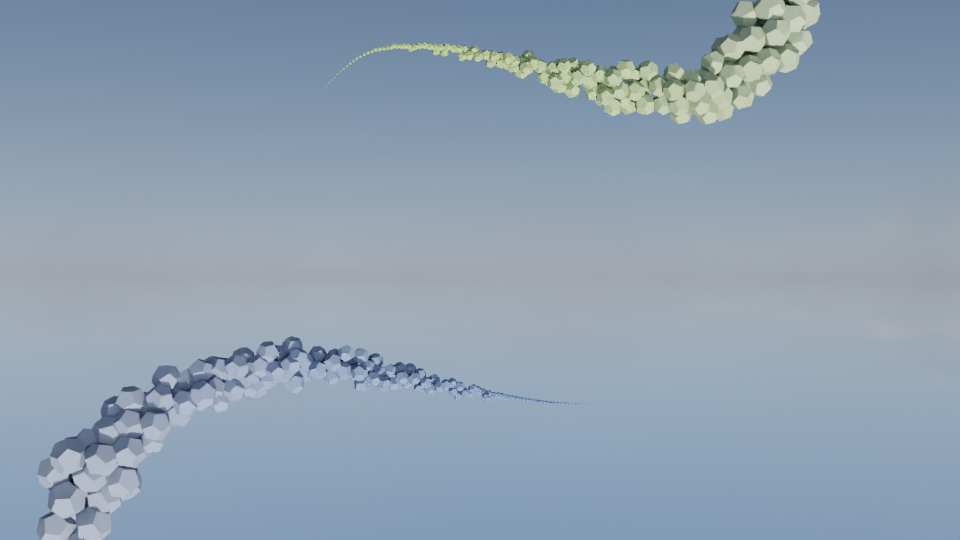

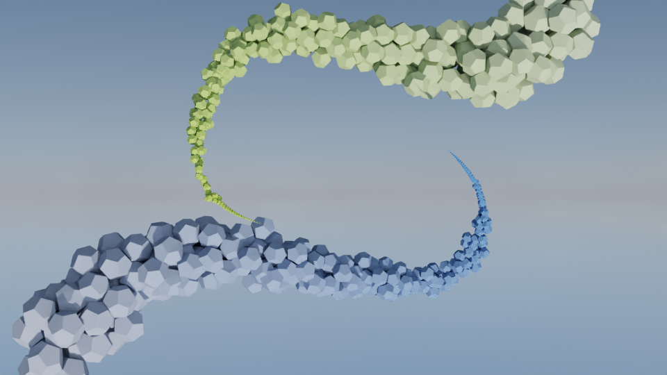

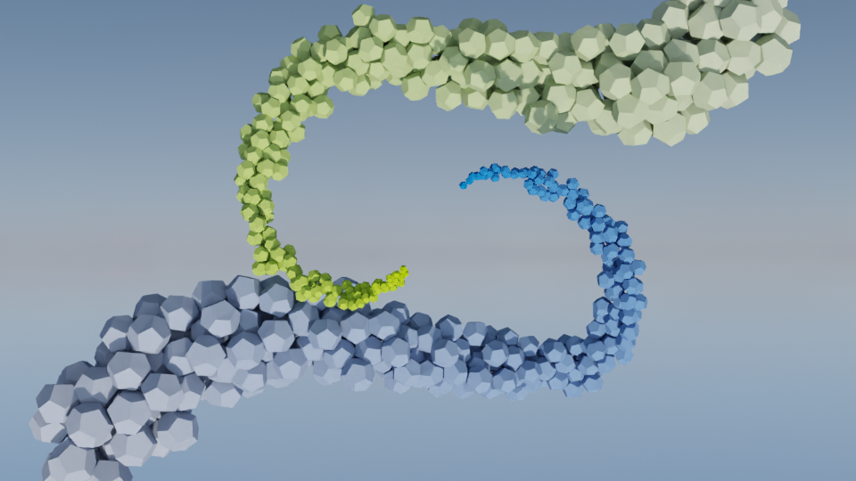

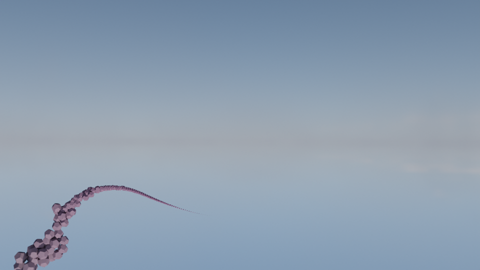

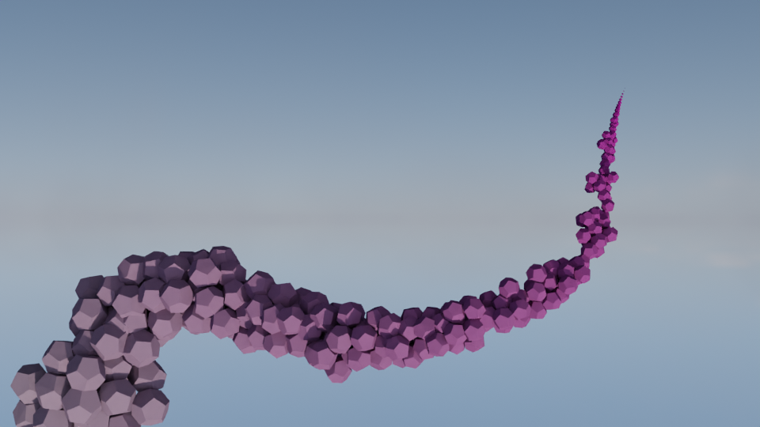

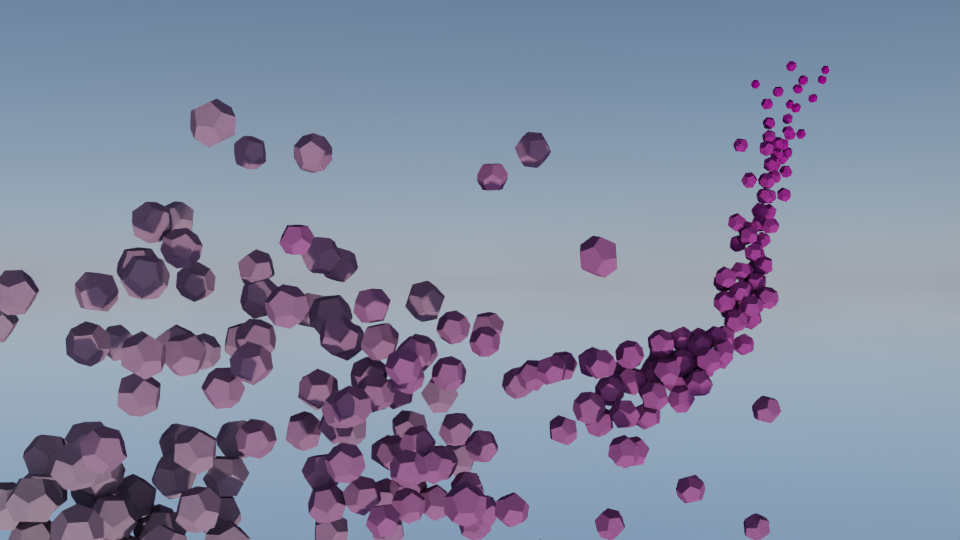

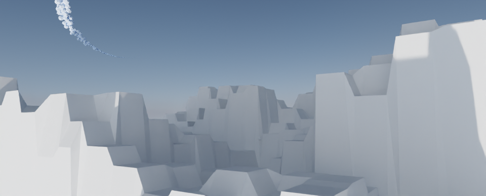

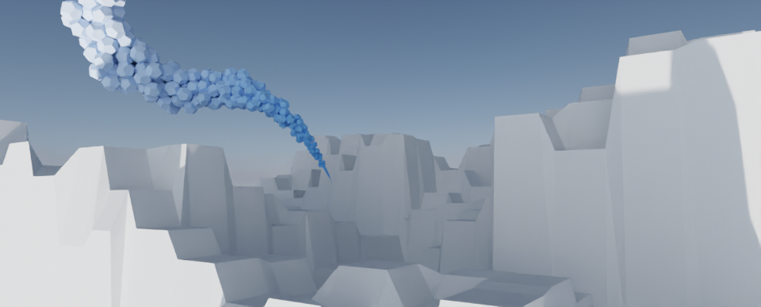

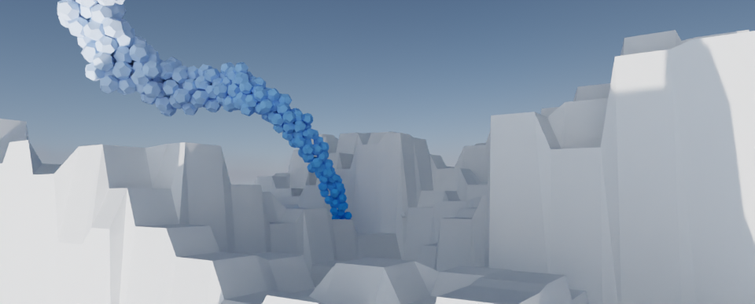

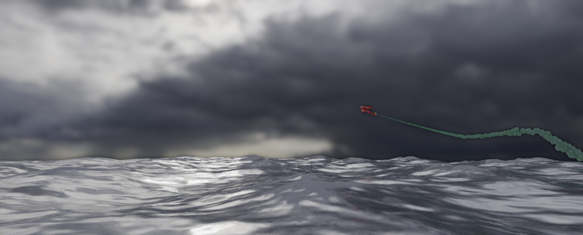

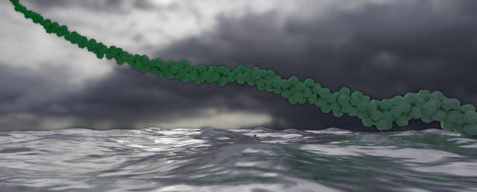

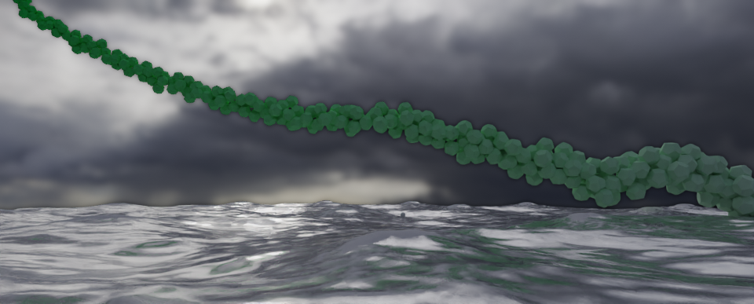

## Examples

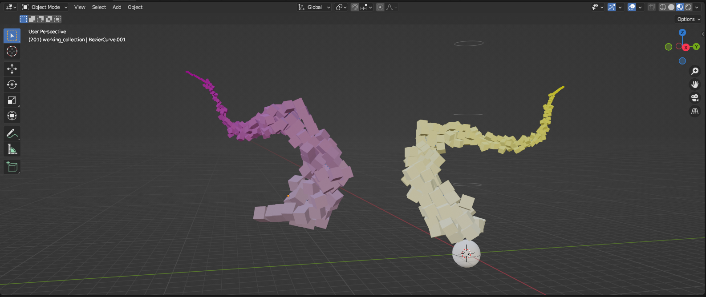

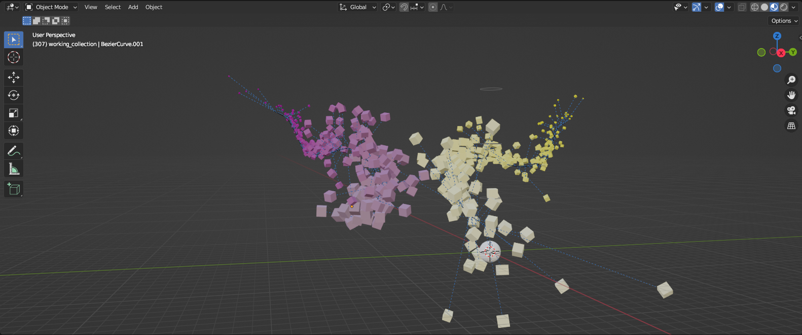

## How it works:

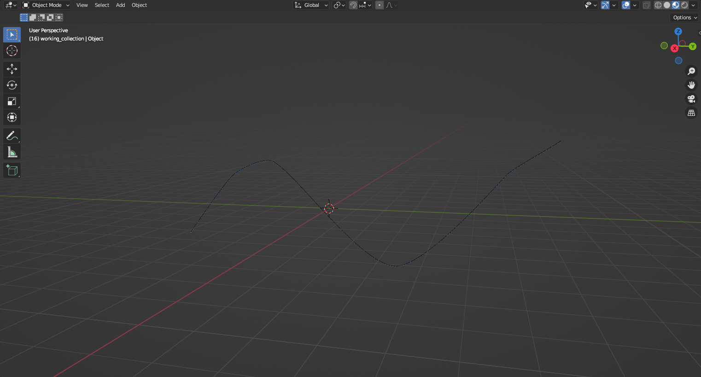

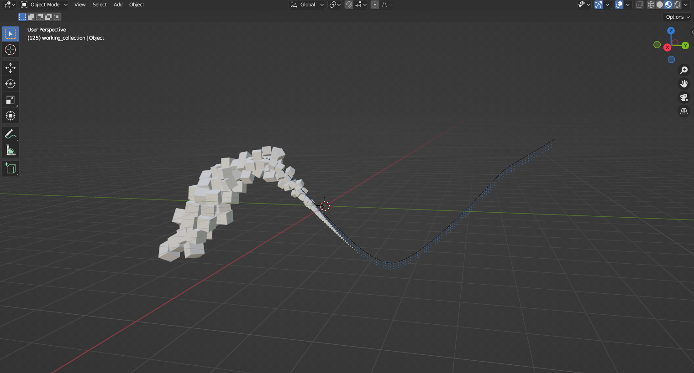

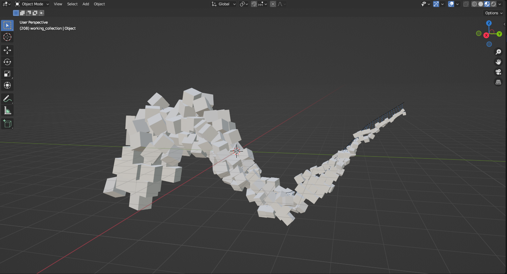
